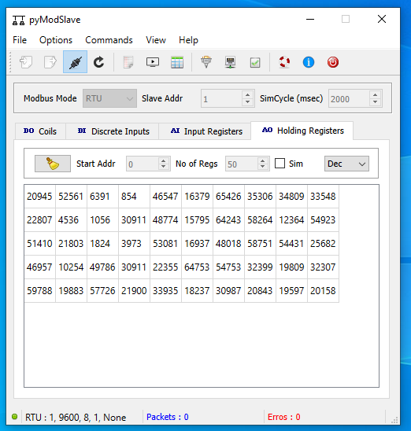
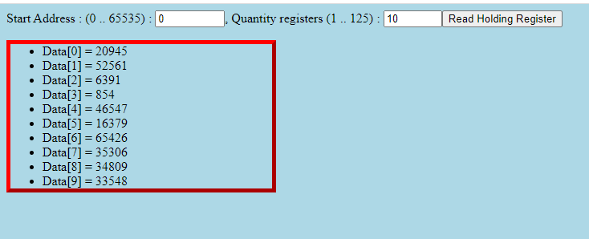

## Testing in HTML file

In the test directory are the HTML testing programs. For the test 
- run the [modbusbackend and test](README.md) and stay run the modbusbackend!
- stay to run the modbusbackend, and modbus simulator.

Example the simulator with random holding datas:

- open the test/testGetfromHTML.html
You can see:

