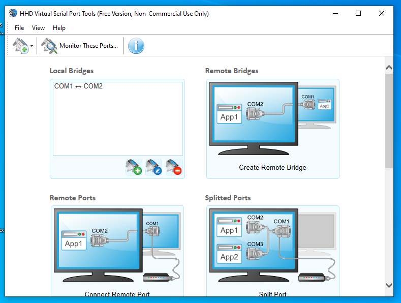
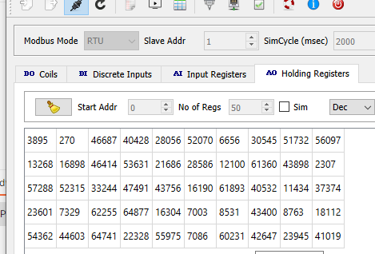
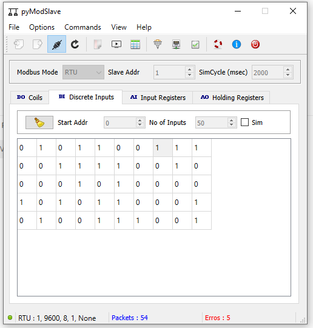
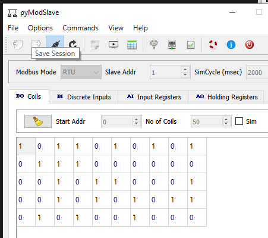
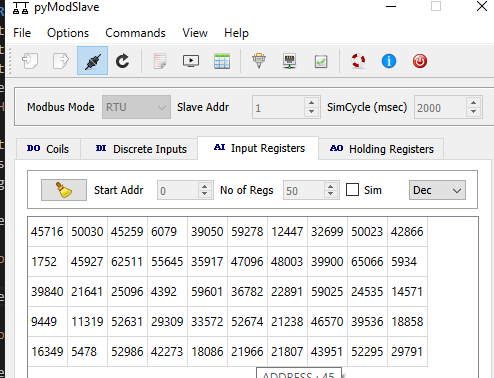

# scadaMODBUS 
Simple SCADA program for MODBUS presented data.
The goal of the SCADA MODBUS program is to offer a program of SCADA functions from standard MODBUS data sources. The nodejs 


- MODBUS serial reading.
- GET request solution in nodejs. GETting modbus data.
- PUT command in nodejs. PUTting modbus address data with desired value.

## Installation

- Download, and install the nodejs.
- Install the express and the serialport libraries to nodejs.
npm install express
npm install serialport

## Running (testing)
My test enviroment contains a virtual serial port, a Modbus client application, and the Postman application. 
Test methode:
- Start the virtual serial port program. I use at now the <a href="https://www.hhdsoftware.com/" target="_blank">HHD softwares.</a> program's free non commercial version. I already made the either COM1 and COM2 ports and connected them.


- Start the MODBUS client program. My preferred application is the <a href="https://sourceforge.net/projects/pymodslave/" target="_blank">PyModbusslave from sourceforge.</a>. This is a portable small program. Set the serial port to COM1 9600 8 1 none then push connect and open the Holding Registers table then checked then uncheck Sim checkbox. The program will fill the 50 registers the random integer datas and ready own the MODBUS request to answering.


### Examples the MODBUS client program

- Set the modbus client holding registers.



- Set the modbus client discrete inputs registers.



- Set the modbus client coils registers.



- Set the modbus input registers.



- open the visual studion code (or your so loved IDE.) Open the github cloned nodejs files then start in the terminal a index.js file. Type the terminal :
node .\index.js (The modbusbackend opening the COM2 port. If you have to you can change the com port in index.js file.)
You can see as is this: <p>

Some basic Git commands are:
```
PS C:\Users\bekeband\repos\scadaMODBUS> node .\index.js
bandiSCADA simple scada backend for MODBUS datas.
App listening at http://localhost:3000
```

 ## Running Postman
- run the <a href="https://www.postman.com/" target="_blank"> postman </a> application.

#### Test the get status program.


### Test the get.
- RHR (Read holding register) command.
- Type the postman the get command:
http://localhost:3000/RHR/2/4
- If all right the returned jSon datas are:

    {
        "register": 2,
        "value": 46687
    },
    {
        "register": 3,
        "value": 40428
    },
    {
        "register": 4,
        "value": 28056
    },
    {
        "register": 5,
        "value": 52070
    }

- RC (Read coils) command.
- Type the postman the get command:
http://localhost:3000/RC/0/23
- If all right the returned jSon datas are:

{
        "register": 0,
        "value": 173
    },
    {
        "register": 1,
        "value": 58
    },
    {
        "register": 2,
        "value": 64
    }

- RDI (Read discrete inputs) command.
- Type the postman the get command:
http://localhost:3000/RDI/0/9
- If all right the returned jSon datas are:

{
        "register": 0,
        "value": 154
    },
    {
        "register": 1,
        "value": 1
    }

- RIR (Read input registers) command.
- Type the postman the get command:
http://localhost:3000/RIR/2/4
- If all right the returned jSon datas are:

 {
        "register": 2,
        "value": 45259
    },
    {
        "register": 3,
        "value": 6079
    },
    {
        "register": 4,
        "value": 39050
    },
    {
        "register": 5,
        "value": 59278
    }

### Test the write commands. 
- run the <a href="https://www.postman.com/" target="_blank"> postman </a> application.
- Write Single Coil 5, to 1. To setting bit the value have to be any greater then 0, and to reset the value have to be 0.
http://localhost:3000/WSC/5/02  

- The Postman result is:

"Writing data OK."


- Write Single Register 9 to 856. It will write the 9th register with 856dec data.
- Type the postman the get command 
http://localhost:3000/WSR/9/856  

- The Postman result is:

"Writing data OK."


