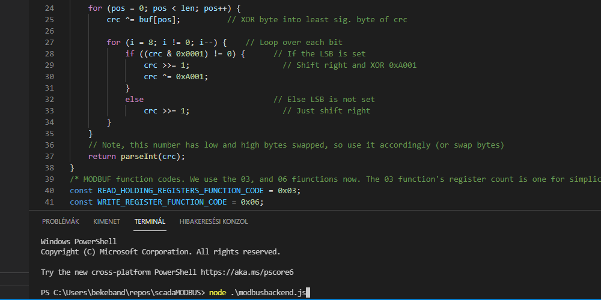
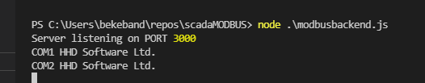
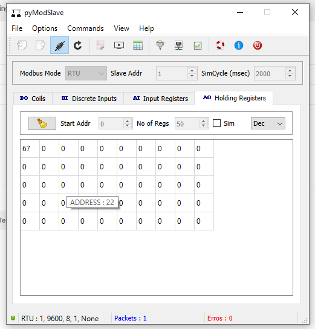

# scadaMODBUS 
Simple SCADA program for MODBUS presented data.
The goal of the SCADA MODBUS program is to offer a program of SCADA functions from standard MODBUS data sources. The nodejs 

- MODBUS serial reading.
- GET request solution in nodejs. GETting modbus data.
- PUT command in nodejs. PUTting modbus address data with desired value.

## Installation

- Download, and install the [nodejs](https://nodejs.dev/download).
- Install the express and the serialport libraries to nodejs.
npm install express
npm install serialport

## Running (testing)
My test enviroment contains a virtual serial port, a Modbus client application, and the Postman application. 
Test methode:
- Start the virtual serial port program. I use at now the [HHD softwares](https://www.hhdsoftware.com/) program's free non commercial version. I already made the either COM1 and COM2 ports and connected them.

- Start the MODBUS client program. My preferred application is the [PyModbusslave from sourceforge.](https://sourceforge.net/projects/pymodslave/). This is a portable small program. Set the serial port to COM1 9600 8 1 none then push connect and open the Holding Registers table then checked then uncheck Sim checkbox. The program will fill the 50 registers the random integer datas and ready own the MODBUS request to answering.

- open the visual studion code (or your so loved IDE.) Open the github cloned nodejs files then start in the terminal a modbusbackend.js file. Type the terminal :
node .\modbusbackend.js (The modbusbackend opening the COM2 port. If you have to you can change the com port in modbusbackend.js file.)

- Start the modbusbackend program:

In case of the successfully started You can see as is this: 

 ## Running Postman
- run the [Postman](https://www.postman.com/) application.

### Test the get command.
- Type the postman the get command:
http://localhost:3000/test/holding/get/0
- If all right the answer is

### Test the put command. 
- run the [postman](https://www.postman.com/) application.
- Type the postman the get command:
http://localhost:3000/test/holding/set/0/67

You can see the writing Modbus data (67) on the first Modbus register.

 [Postman](https://www.postman.com/).

